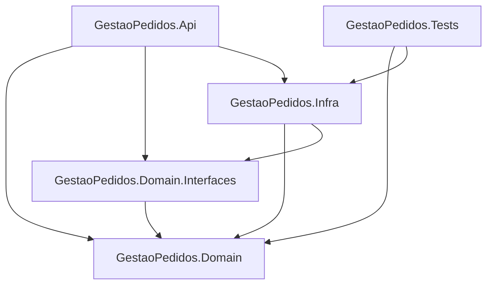

# GestaoPedidosAPI

[](https://github.com/louresb/GestaoPedidosAPI/actions/workflows/dotnet.yml)


Projeto desenvolvido como solução para o desafio técnico de Desenvolvedor Back-End.

## 🎯 Objetivo do Desafio

Criar uma WebAPI em ASP.NET Core para gerenciar os pedidos de uma loja, com as seguintes rotas:

- Iniciar um novo pedido
- Adicionar produtos a um pedido
- Remover produtos de um pedido
- Fechar um pedido
- Listar pedidos com suporte a paginação e filtro por status
- Obter detalhes de um pedido e seus produtos pelo ID

**Condições**:
- Não é permitido adicionar/remover produtos em pedidos fechados
- Um pedido só pode ser fechado se contiver pelo menos um produto

**Tecnologias solicitadas**:
- ASP.NET Core
- Entity Framework Core (InMemory para simplicidade)

**Tarefas opcionais implementadas**:
- Testes unitários utilizando xUnit
- Paginação na listagem de pedidos
- Filtro por status (aberto/fechado)
- Documentação automática da API com Swagger

## 📦 Estrutura do Projeto

O projeto segue o padrão de separação em múltiplas camadas utilizando DDD (Domain-Driven Design):



### Principais Padrões e Boas Práticas

- Separacão de responsabilidades (API, Domínio, Infraestrutura)
- Princípios SOLID aplicados
- Uso de Repositórios para abstração da persistência
- Testes unitários focados nas regras de negócio

## 🚀 Tecnologias Utilizadas

- C#
- .NET 8
- ASP.NET Core
- Entity Framework Core (InMemory)
- Swagger / Swashbuckle
- xUnit
- GitHub Actions (CI)

## ⚙️ Como Executar

Pré-requisitos:
- .NET 8 SDK instalado

1. Clone o repositório:

```bash
git clone https://github.com/louresb/GestaoPedidosAPI.git
```

2. Navegue até a pasta da API:

```bash
cd GestaoPedidosAPI/src/GestaoPedidos.Api
```

3. Restaure as dependências:

```bash
dotnet restore
```

4. Execute a aplicação:

```bash
dotnet watch run
```

5. Acesse o Swagger para explorar a API:

```
https://localhost:{porta}/swagger
```

📌 **Observação**: O banco de dados utilizado é o InMemory, não sendo necessária configuração adicional.

## 📖 API - Endpoints Principais

| Método | Endpoint                            | Descrição                                          |
|--------|-------------------------------------|--------------------------------------------------|
| POST   | `/api/v1/pedido`                    | Iniciar um novo pedido                           |
| POST   | `/api/v1/pedido/{id}/produto`        | Adicionar produto a um pedido                    |
| DELETE | `/api/v1/pedido/{id}/produto/{produtoId}` | Remover produto de um pedido                  |
| PUT    | `/api/v1/pedido/{id}/fechar`         | Fechar um pedido (se tiver produtos)             |
| GET    | `/api/v1/pedido`                     | Listar pedidos com paginação e filtro por status |
| GET    | `/api/v1/pedido/{id}`                | Obter detalhes de um pedido e seus produtos      |

### Exemplos de Uso da API

#### ➕ Adicionar Produto a um Pedido

**Endpoint:** `POST /api/v1/pedido/{id}/produto`

**Exemplo de chamada:**
```http
POST /api/v1/pedido/1/produto
```

**Body (JSON):**
```json
{
  "produtoId": 1,
  "quantidade": 2
}
```
> Substitua `{id}` na URL pelo ID do pedido criado anteriormente.

---

#### 🔎 Listar Pedidos com Paginação e Filtro

**Endpoint:** `GET /api/v1/pedido`

**Exemplo de chamada:**
```http
GET /api/v1/pedido?page=1&pageSize=10&status=0
```

**Parâmetros de query:**
- `page`: Número da página
- `pageSize`: Número de itens por página
- `status`: Status do pedido (0 = Aberto, 1 = Fechado)

---

Documentação completa disponível via Swagger na aplicação.

## 🧪 Testes Unitários

- Implementados utilizando **xUnit**.
- Testes focados em:
  - Regras de adição e remoção de produtos
  - Fechamento de pedidos
  - Cálculo correto do valor total dos pedidos

Executar os testes:

```bash
cd tests/GestaoPedidos.Tests
dotnet test
```

## 🛠️ Integração Contínua

- Pipeline de **CI** configurado com **GitHub Actions**:
  - Restore de dependências
  - Build do projeto
  - Execução dos testes unitários
- Builds e testes são executados automaticamente em cada push.

## 📂 Banco de Dados

- Utilizado **Entity Framework Core InMemory**.
- Produtos pré-cadastrados em tempo de execução via classe `SeedData`.

| Produto   | Preço (R$) |
|-----------|------------|
| Produto A | 10,10      |
| Produto B | 20,25      |
| Produto C | 30,50      |
